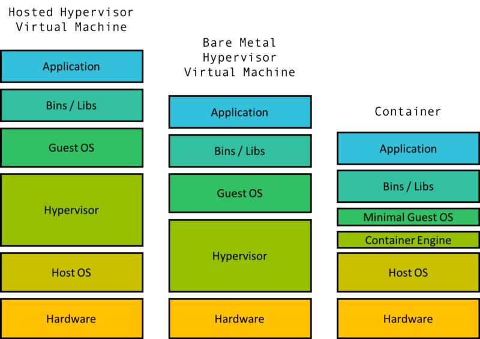

## _Modularisez et maîtrisez vos applications_

---

# Introduction

- ## La métaphore docker : "box it, ship it"

- Une abstraction qui ouvre de nouvelles possibilités pour la manipulation logicielle.
- Permet de standardiser et de contrôler la livraison et le déploiement.

# Retour sur les technologies de virtualisation

On compare souvent les conteneurs aux machines virtuelles. Mais ce sont de grosses simplifications parce qu'on en a un usage similaire : isoler des programmes dans des "contextes".

  Une chose essentielle à retenir sur la différence technique : **les conteneurs utilisent les mécanismes internes du \_kernel de l'OS **Linux**\_ tandis que les VM tentent de communiquer avec l'OS (quel qu'il soit) pour directement avoir accès au matériel de l'ordinateur.**

<!--  -->

- **VM** : une abstraction complète pour simuler des machines

  - un processeur, mémoire, appels systèmes, carte réseau, carte graphique, etc.

- **conteneur** : un découpage dans Linux pour séparer des ressources (accès à des dossiers spécifiques sur le disque, accès réseau).
                  Un conteneur Linux est un processus ou un ensemble de processus isolés du reste du système, tout en étant légers.

Les deux technologies peuvent utiliser un système de quotas pour l'accès aux ressources matérielles (accès en lecture/écriture sur le disque, sollicitation de la carte réseau, du processeur)

Si l'on cherche la définition d'un conteneur :

**C'est un groupe de _processus_ associé à un ensemble de permissions**.

L'imaginer comme une "boîte" est donc une allégorie un peu trompeuse, car ce n'est pas de la virtualisation (= isolation au niveau matériel).

---

# Les conteneurs : définition

On revient à notre définition d'un **conteneur** :

### **Un conteneur est un groupe de _processus_ associé à un ensemble de permissions sur le système**.

> 1 container
> = 1 groupe de _process_ Linux
>
> - des _namespaces_
> - des _cgroups_ (quota en ressources matérielles)

---

# Bénéfices par rapport aux machines virtuelles

Docker permet de faire des "quasi-machines" avec des performances proches du natif.

- Vitesse d'exécution.
- Flexibilité sur les ressources (mémoire partagée).
- Moins **complexe** que la virtualisation
- Plus **standard** que les multiples hyperviseurs
  - notamment moins de bugs d'interaction entre l'hyperviseur et le noyau

---

# Bénéfices par rapport aux machines virtuelles

VM et conteneurs proposent une flexibilité de manipulation des ressources de calcul mais les machines virtuelles sont trop lourdes pour être multipliées librement :

- elles ne sont pas efficaces pour isoler **chaque application**
- elles ne permettent pas la transformation profonde que permettent les conteneurs :
  - le passage à une architecture **microservices**
  - et donc la **scalabilité** pour les besoins des services cloud

---

# Avantages des machines virtuelles

- Les VM se rapprochent plus du concept de "boite noire": l'isolation se fait au niveau du matériel et non au niveau du noyau de l'OS.

- même si une faille dans l'hyperviseur reste possible car l'isolation n'est pas qu'uniquement matérielle

- Les VM sont-elles "plus lentes" ? Pas forcément.
  - La RAM est-elle un facteur limite ? Non elle n'est pas cher
  - Les CPU pareil : on est rarement bloqués par la puissance du CPU
  - Le vrai problème c'est l'I/O : l'accès en entrée-sortie au disque et au réseau
    - en réalité Docker peut être bien plus lent pour l'implémentation de la sécurité réseau (usage du NAT et du bridging)
    - pareil pour l'accès au disque : la technologie d'_overlay_ (qui a une place centrale dans Docker) s'améliore mais reste lente.

La comparaison VM / conteneurs est un thème extrêmement vaste et complexe.

---

# Pourquoi utiliser Docker ?

Docker est pensé dès le départ pour faire des **conteneurs applicatifs** :

- **isoler** les modules applicatifs.

- gérer les **dépendances** en les embarquant dans le conteneur.

- se baser sur l'**immutabilité** : la configuration d'un conteneur n'est pas faite pour être modifiée après sa création.

- avoir un **cycle de vie court** -> logique DevOps du "bétail vs. animal de compagnie"

---

# Pourquoi utiliser Docker ?

Docker modifie beaucoup la **"logistique"** applicative.

- **uniformisation** face aux divers langages de programmation, configurations et briques logicielles

- **installation sans accroc** et **automatisation** beaucoup plus facile

- permet de simplifier l'**intégration continue**, la **livraison continue** et le **déploiement continu**

- **rapproche le monde du développement** des **opérations** (tout le monde utilise la même technologie)

- Permet l'adoption plus large de la logique DevOps (notamment le concept _d'infrastructure as code_)

---

# Infrastructure as Code

## Résumé

- on décrit en mode code un état du système. Avantages :
  - pas de dérive de la configuration et du système (immutabilité)
  - on peut connaître de façon fiable l'état des composants du système
  - on peut travailler en collaboration plus facilement (grâce à Git notamment)
  - on peut faire des tests
  - on facilite le déploiement de nouvelles instances

---

# Docker : positionnement sur le marché

- Docker est la technologie ultra-dominante sur le marché de la conteneurisation
  - La simplicité d'usage et le travail de standardisation (un conteneur Docker est un conteneur OCI : format ouvert standardisé par l'Open Container Initiative) lui garantissent légitimité et fiabilité
  - La logique du conteneur fonctionne, et la bonne documentation et l'écosystème aident !

- **LXC** existe toujours et est très agréable à utiliser, notamment avec **LXD** (développé par Canonical, l'entreprise derrière Ubuntu).
  - Il a cependant un positionnement différent : faire des conteneurs pour faire tourner des OS Linux complets.

- **Apache Mesos** : un logiciel de gestion de cluster qui permet de se passer de Docker, mais propose quand même un support pour les conteneurs OCI (Docker) depuis 2016.

- **Podman** : une alternative à Docker qui utilise la même syntaxe que Docker pour faire tourner des conteneurs OCI (Docker) qui propose un mode *rootless* et *daemonless* intéressant.

- **systemd-nspawn** : technologie de conteneurs isolés proposée par systemd

---
